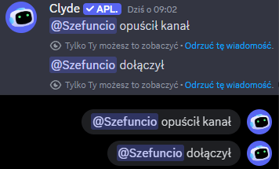
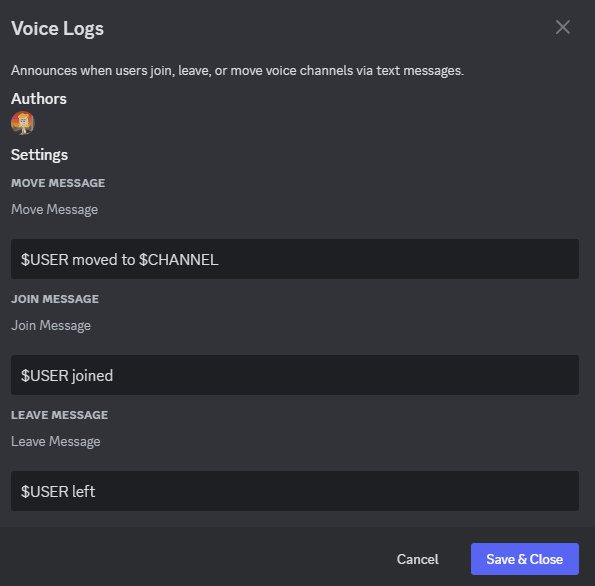

<h1>🎙️ Voice Logs</h1>

Get notified when users join, leave, or switch voice channels with automated text messages. Inspired by Voice narrator plugin.

## 📌 Features

- Announce when users:
  1. Join voice channels.
  2. Leave voice channels.
  3. Switch between voice channels.

## 👀 Preview

## ⚙️ Settings

Customize messages for each action (join, move, leave).  
Use the following aliases to personalize your announcements:

1. <code><b>$CHANNEL</b></code> – Mentions the voice channel (<code>&lt;#channelId&gt;</code>).
2. <code><b>$USER</b></code> – Mentions the user (<code>&lt;@userId&gt;</code>).

---
